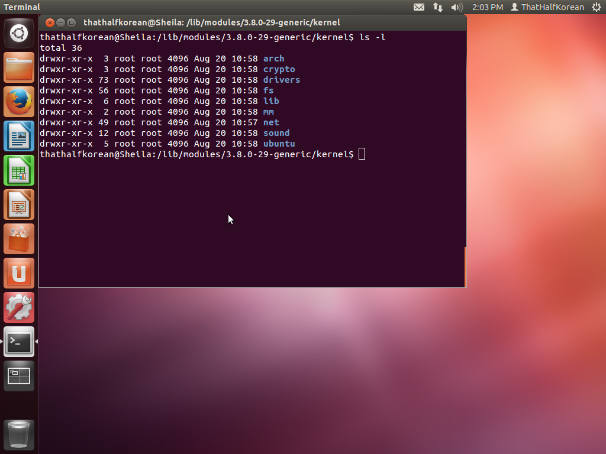
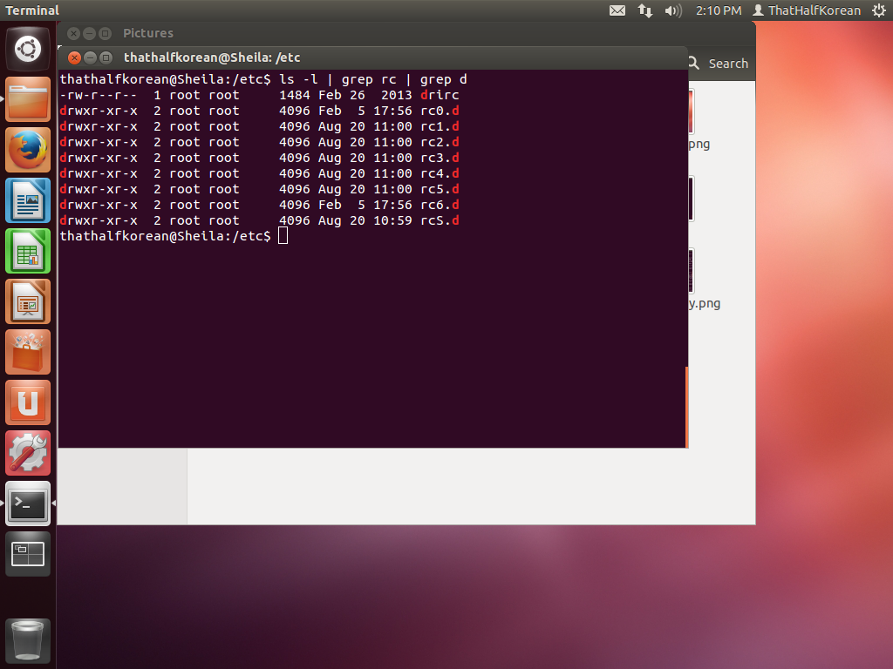
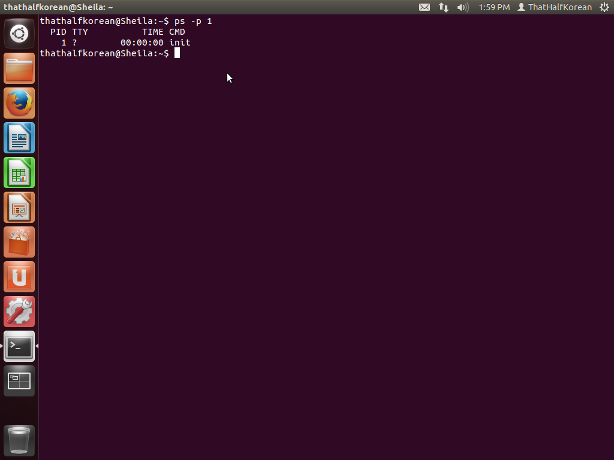
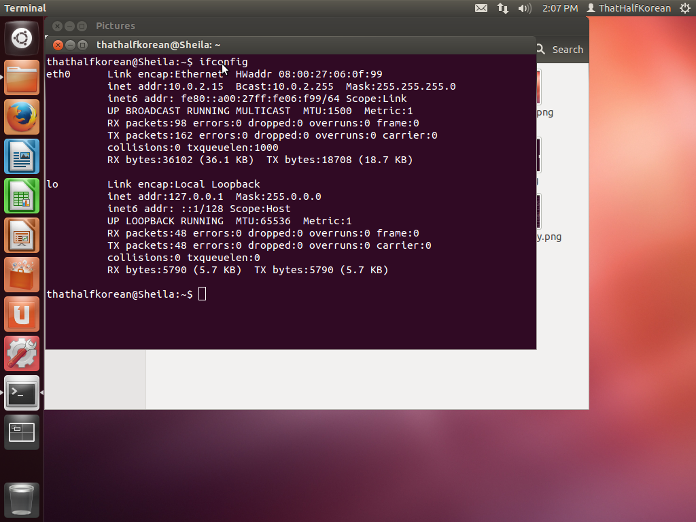

## CSI:OS

### Linux

*JD: Looks like you borrowed Geoff's machine...acceptable for this assignment but not for future ones.*

##### Pre-OS
</img>

##### Kernel
</img>

*JD: This isn't it, actually.  You're looking at kernel module files, which the kernel does load, but not the kernel itself.*

##### Configuration files
</img>

##### First process
</img>

##### Network settings
</img>