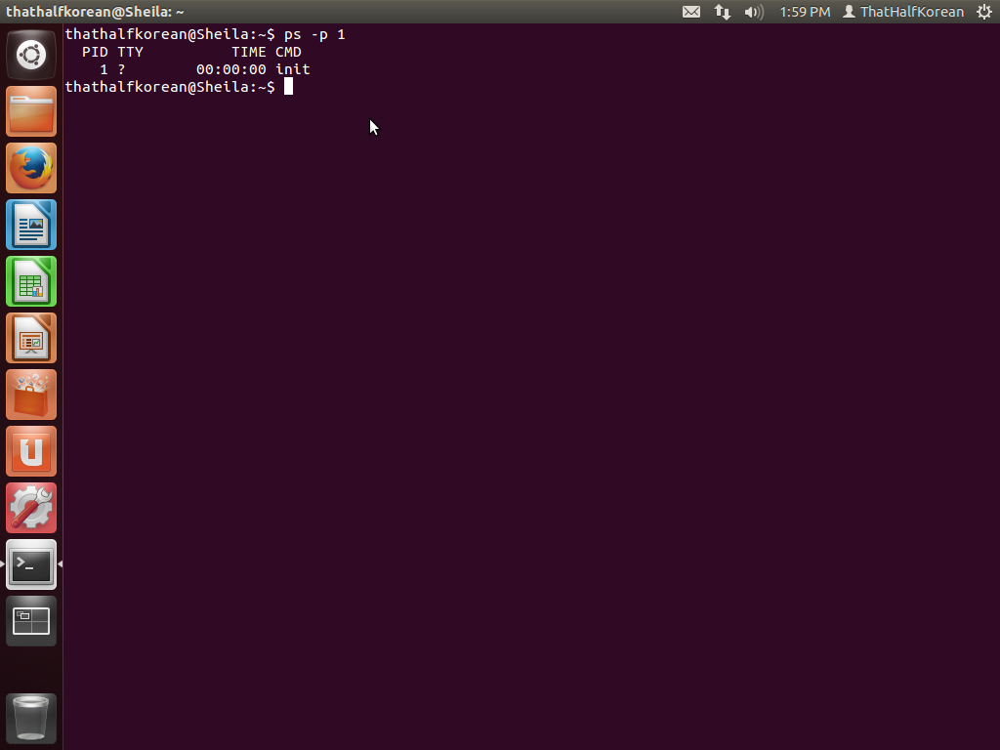

## CSI:OS

### Linux

##### Pre-OS
</img>

##### Kernel
</img>

##### Configuration files
</img>

##### First process
</img>

##### Network settings
</img>

### Mac

##### Pre-OS
</img>

##### Kernel
</img>

##### Configuration files
</img>

##### First process
</img>

##### Network settings
</img>

### Windows

##### Pre-OS
</img>

##### Kernel
</img>

##### Startup Scripts
</img>

##### First process
</img>

##### Network settings
</img>
