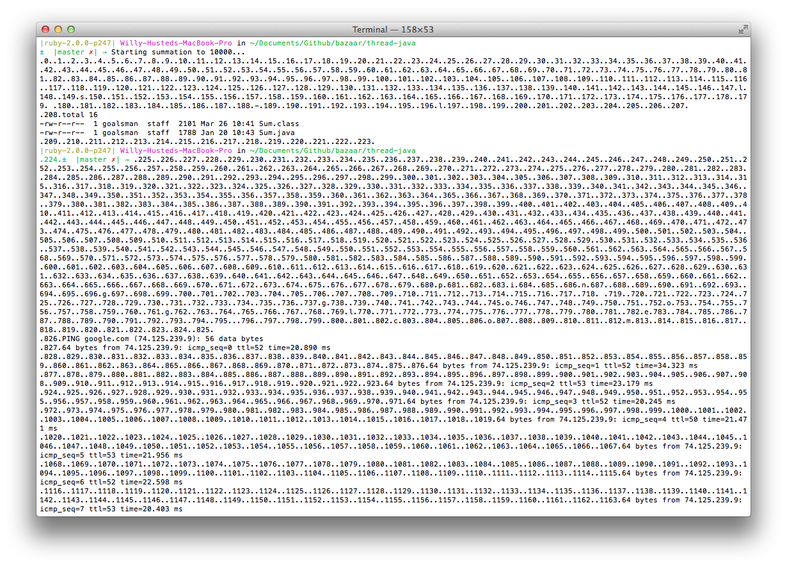
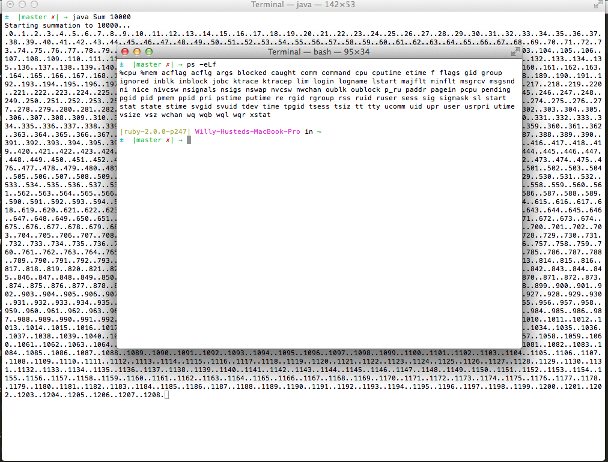
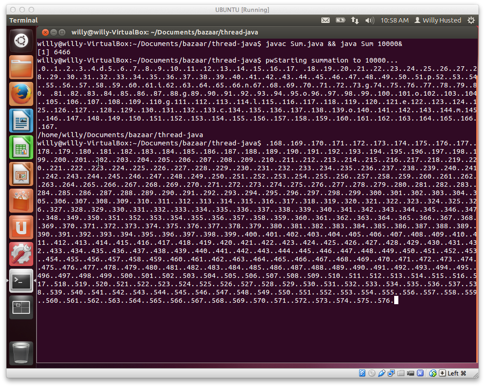
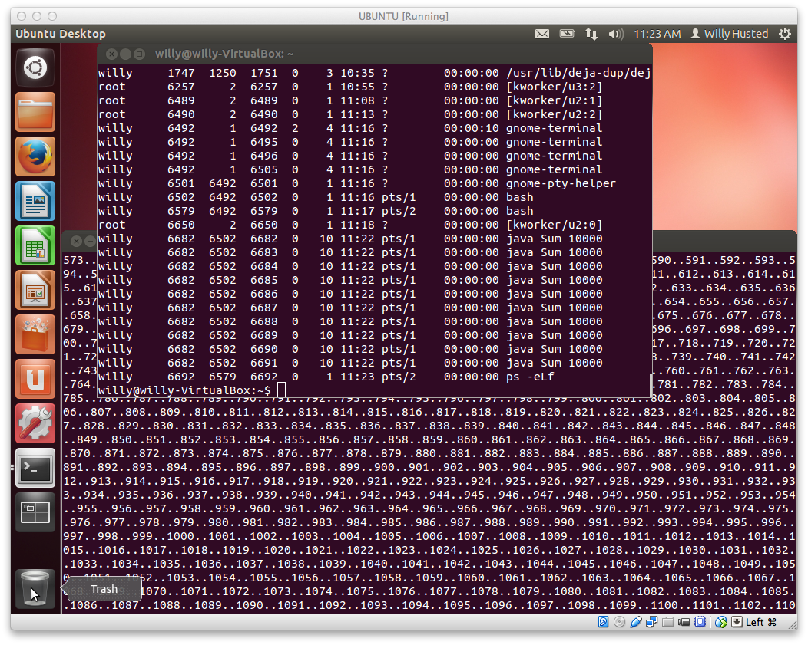

## CSI: Process

### Mac OS X

##### Terminal Hot Mess
</img>
###### This shows Sum.java running concurrently with ls -l and ping google.com

##### Evidence of Threading
</img>
###### This shows Sum.java running in the back terminal while ps -eLf displays the threads of the current program.

### Linux

##### Terminal Hot Mess
</img>
###### This shows Sum.java running concurrently with a pwd call in the middle.

##### Evidence of Threading
</img>
###### This shows Sum.java running in the back terminal while ps -eLf displays the threads of the current program.

##### How do the different operating systems represent the threads?
###### While both Linux and Mac OS X use ps -eLf to track the threads of a program, they display the "evidence" differently, as seen in the screenshots. Mac OS X displays the threads in a single, readable string set; Linux displays the threads in a table, with other information included, such as the user, process ID, etc.